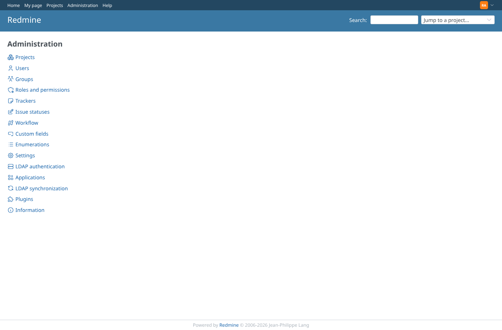
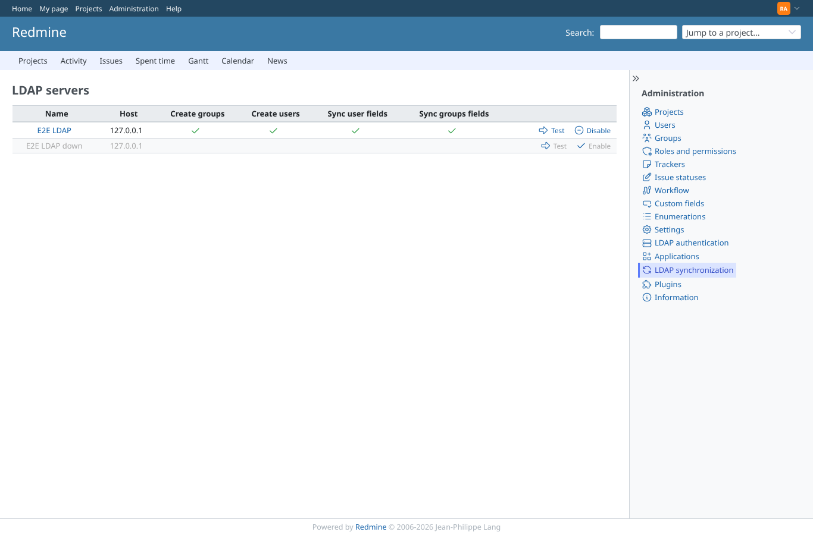
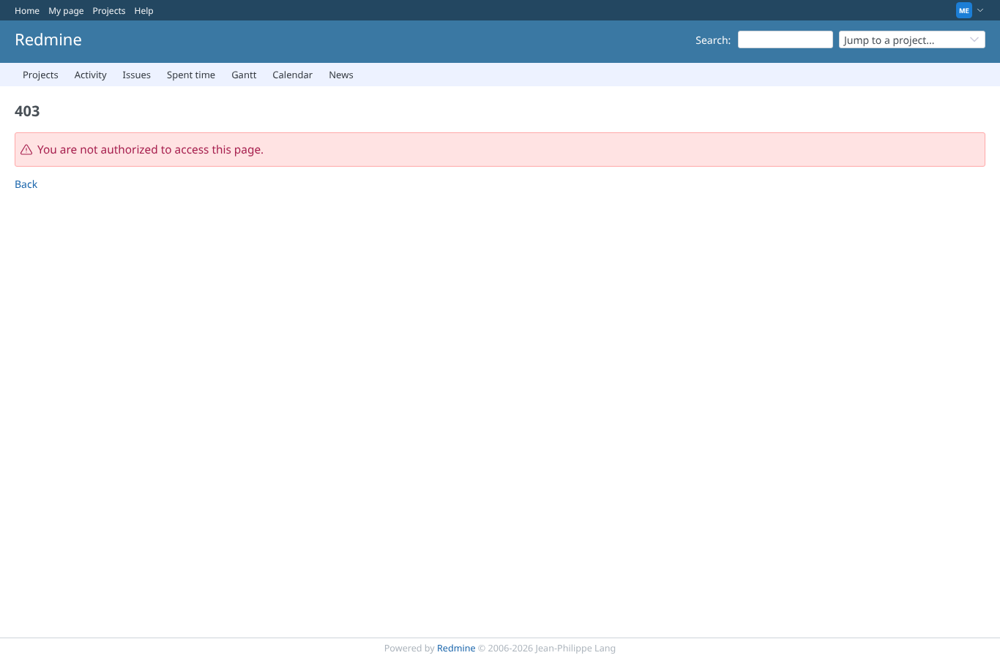

# access

Run 2026-10-07T19:44:27.378Z against http://127.0.0.1:3000.

| screenshot | user | URL | shows |
|---|---|---|---|
|  | admin | `/admin` | Admin menu entry "LDAP synchronization" with the Redmine 7 icon (no tiled image) |
|  | admin | `/admin/ldap_sync` | List of LDAP servers: E2E LDAP enabled, E2E LDAP down (not configured) greyed, Test/Disable/Enable icons |
|  | admin | `/admin/ldap_sync/999/edit` | An LDAP server that does not exist: 404 |
|  | admin | `/admin/ldap_sync` | PUT /admin/ldap_sync/1/disable.js without CSRF token: HTTP 422 (core logs the session out); E2E LDAP is still enabled |
|  | manager | `/admin/ldap_sync/1/edit` | manager (not administrator): the LDAP sync pages answer 403 |
|  | reporter | `/admin/ldap_sync/1/edit` | reporter (not administrator): the LDAP sync pages answer 403 |
|  | outsider | `/admin/ldap_sync/1/edit` | outsider (not administrator): the LDAP sync pages answer 403 |
|  | anonymous | `/login?back_url=http%3A%2F%2F127.0.0.1%3A3000%2Fadmin%2Fldap_sync` | Anonymous: /admin/ldap_sync redirects to the login page |
