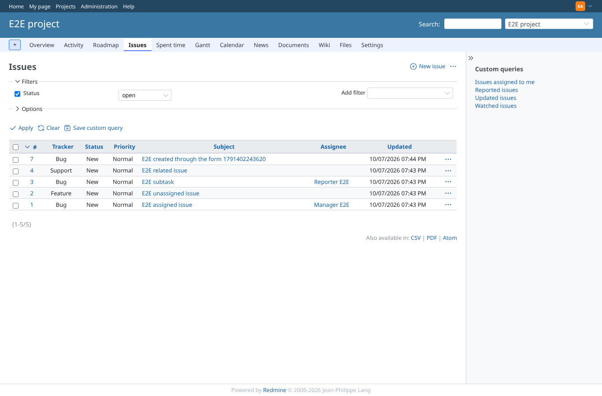
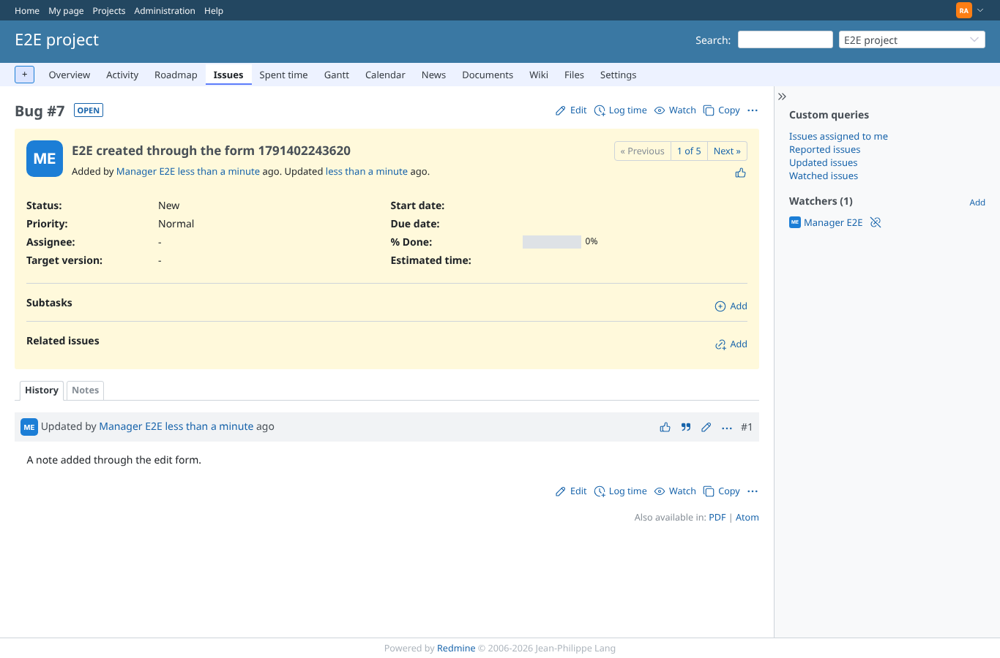
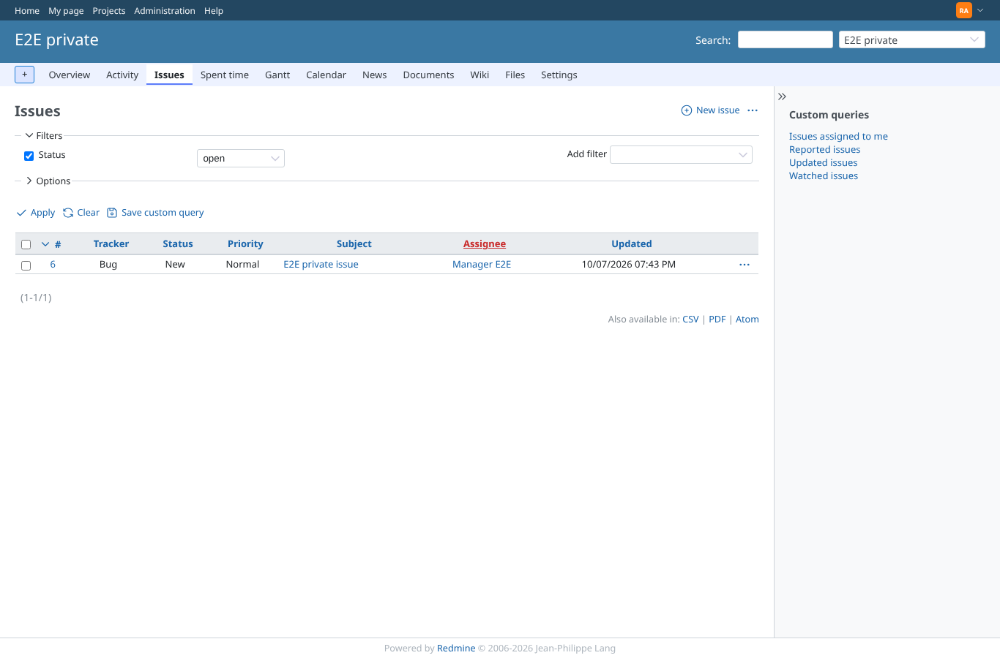
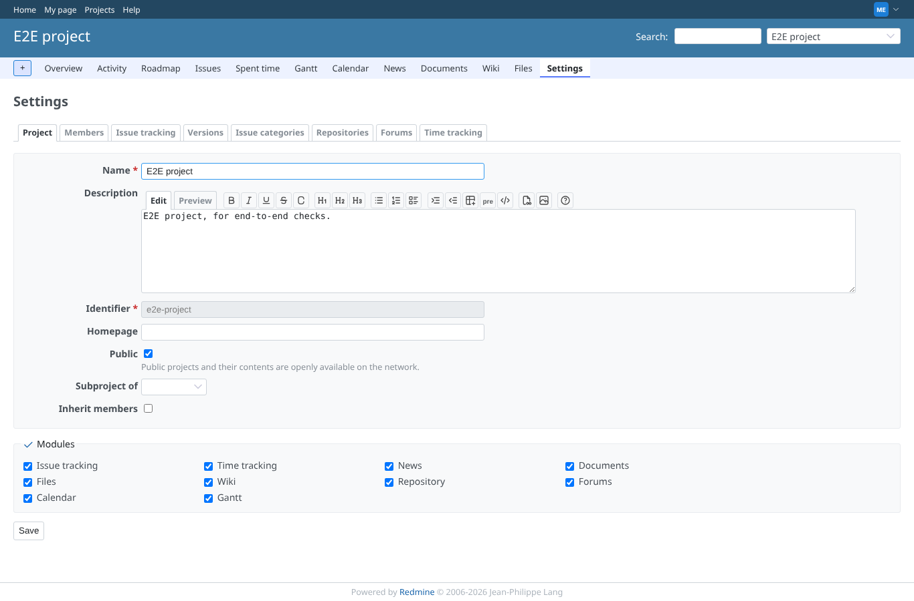
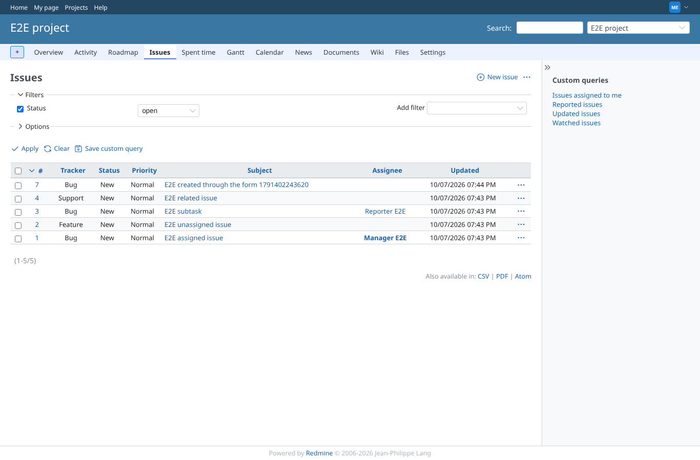
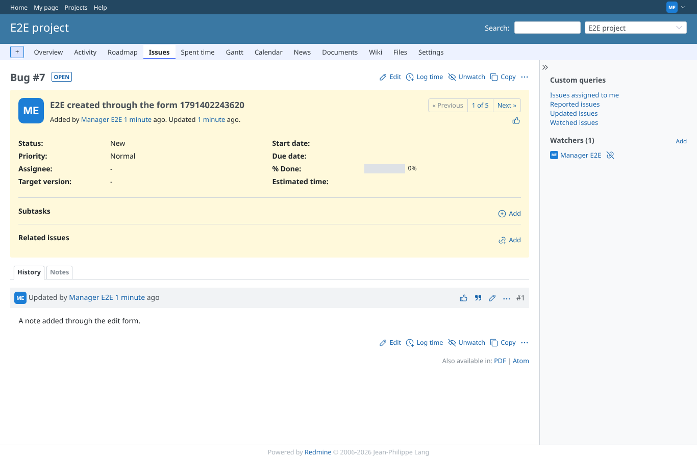
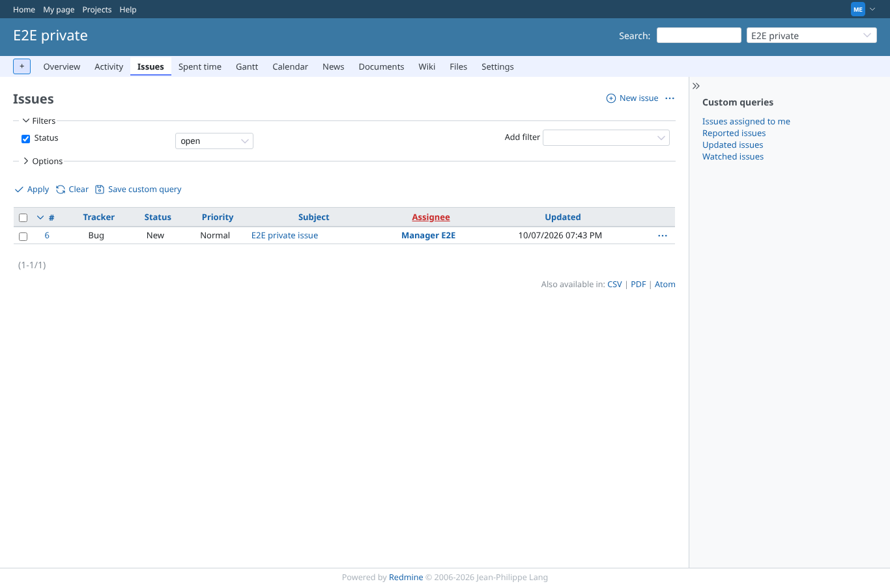
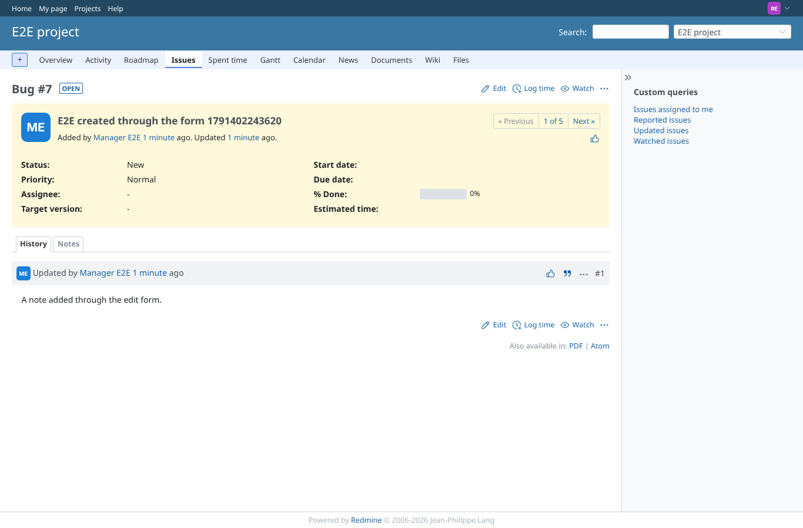
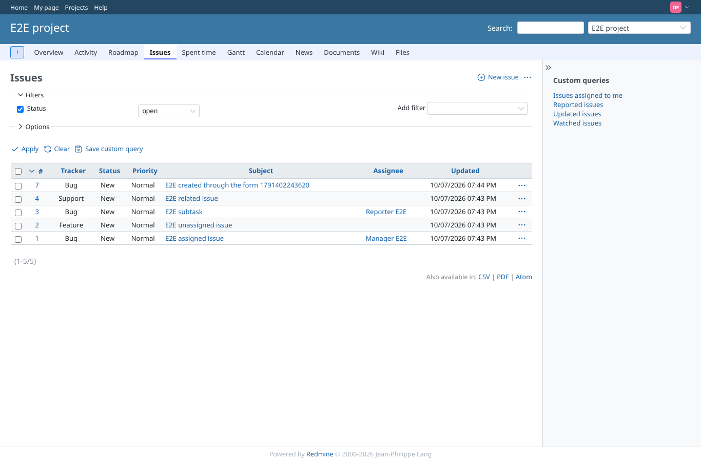
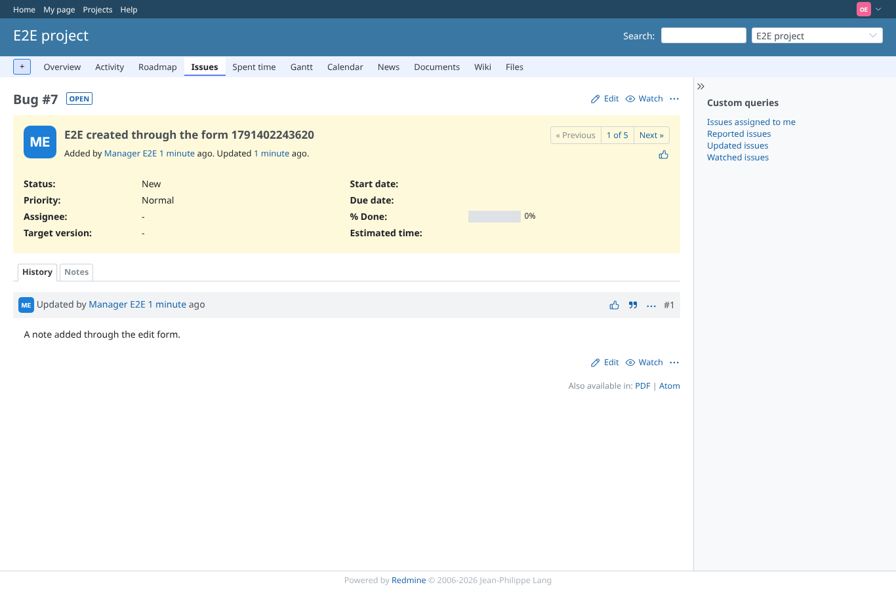

# core_pages

Run 2026-10-07T19:44:47.825Z against http://127.0.0.1:3000.

| screenshot | user | URL | shows |
|---|---|---|---|
|  | admin | `/projects/e2e-project/settings` | admin: Project > Settings answers 200 |
|  | admin | `/projects/e2e-project/issues` | admin: issue list answers 200 |
|  | admin | `/issues/7` | admin: issue #7 answers 200 |
|  | admin | `/projects/e2e-private/issues` | admin: issues of the private project answer 200 |
|  | manager | `/projects/e2e-project/settings` | manager: Project > Settings answers 200 |
|  | manager | `/projects/e2e-project/issues` | manager: issue list answers 200 |
|  | manager | `/issues/7` | manager: issue #7 answers 200 |
|  | manager | `/projects/e2e-private/issues` | manager: issues of the private project answer 200 |
|  | reporter | `/projects/e2e-project/settings` | reporter: Project > Settings answers 403 |
|  | reporter | `/projects/e2e-project/issues` | reporter: issue list answers 200 |
|  | reporter | `/issues/7` | reporter: issue #7 answers 200 |
|  | reporter | `/projects/e2e-private/issues` | reporter: issues of the private project answer 403 |
|  | outsider | `/projects/e2e-project/settings` | outsider: Project > Settings answers 403 |
|  | outsider | `/projects/e2e-project/issues` | outsider: issue list answers 200 |
|  | outsider | `/issues/7` | outsider: issue #7 answers 200 |
|  | outsider | `/projects/e2e-private/issues` | outsider: issues of the private project answer 403 |
