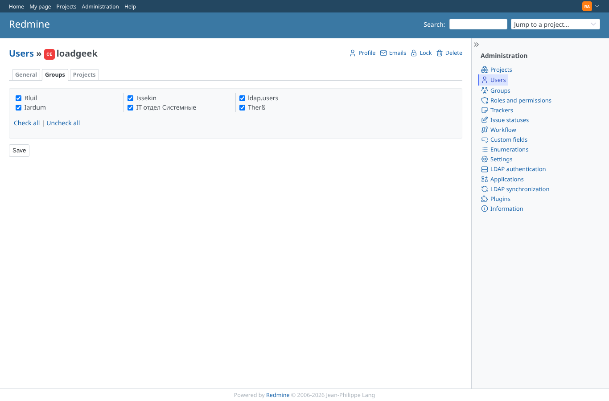
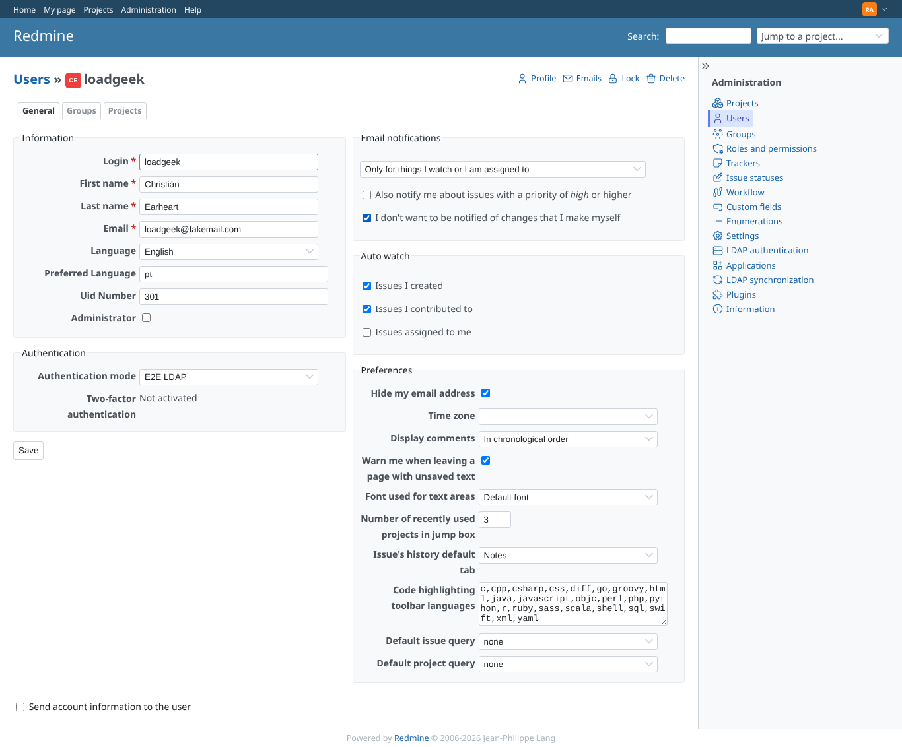
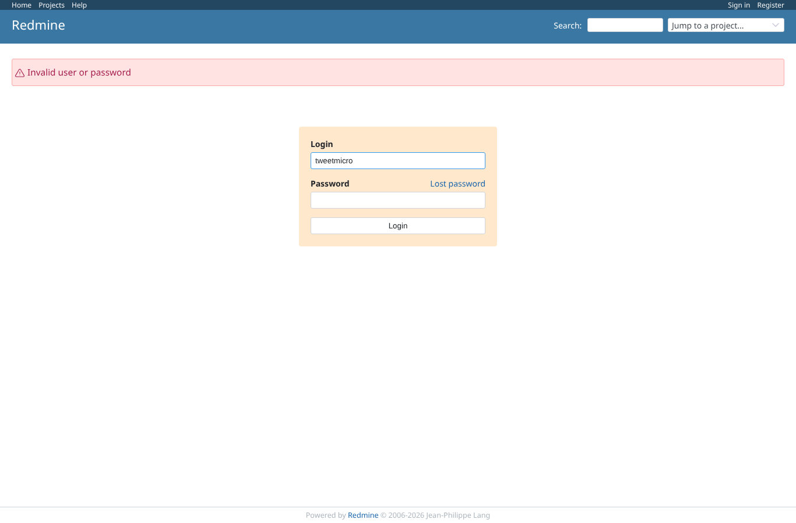
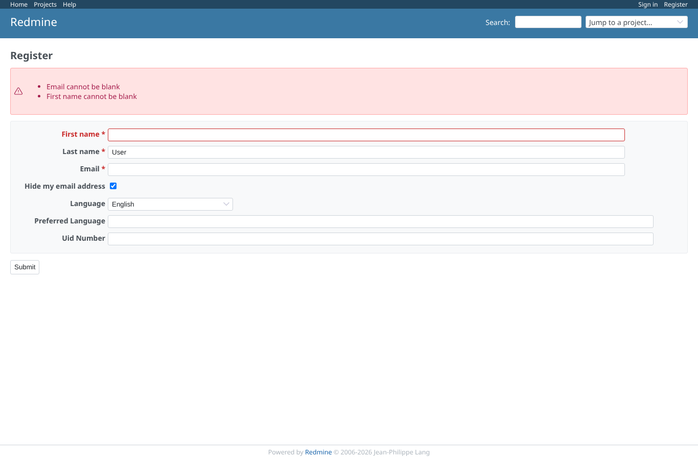
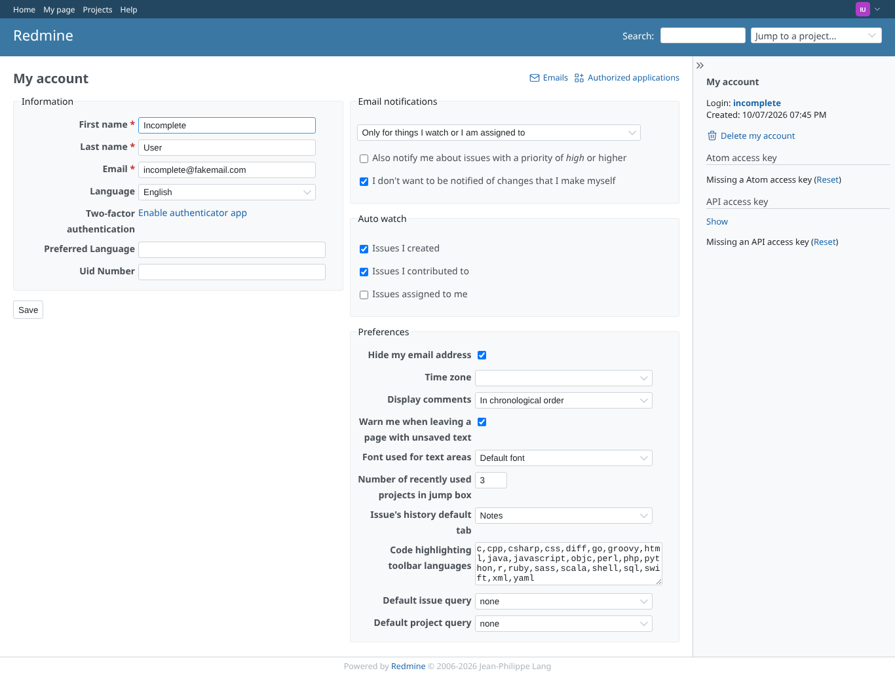

# login_sync

Run 2026-10-07T19:45:22.443Z against http://127.0.0.1:3000.

| screenshot | user | URL | shows |
|---|---|---|---|
|  | loadgeek | `/my/account` | LDAP user loadgeek logs in for the first time: account created with name and mail from LDAP |
|  | admin | `/users/8/edit?tab=groups` | Admin, user loadgeek, tab Groups: LDAP groups (incl. nested and Unicode names) and the fixed group ldap.users |
|  | admin | `/users/8/edit` | Admin, user loadgeek: custom fields Preferred Language and Uid Number synced from LDAP, authentication mode E2E LDAP |
|  | anonymous | `/login` | tweetmicro is disabled on LDAP (account flag "[disabled]"): login refused |
|  | anonymous | `/login` | loadgeek with a wrong password: refused |
|  | anonymous | `/login` | incomplete has no mail on LDAP: Redmine asks to complete the account |
|  | anonymous | `/my/account` | After completing: logged in, the typed mail address is kept (GEOxyz #5245 overwrote it with the login before) |
