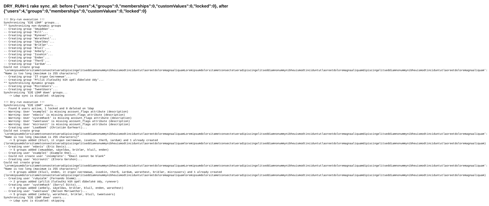
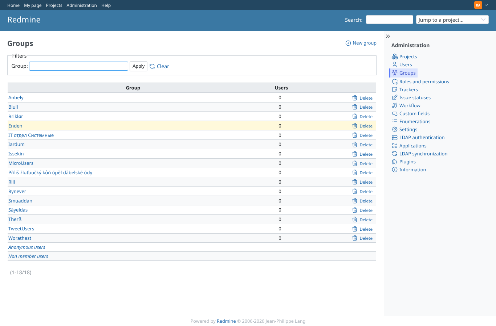
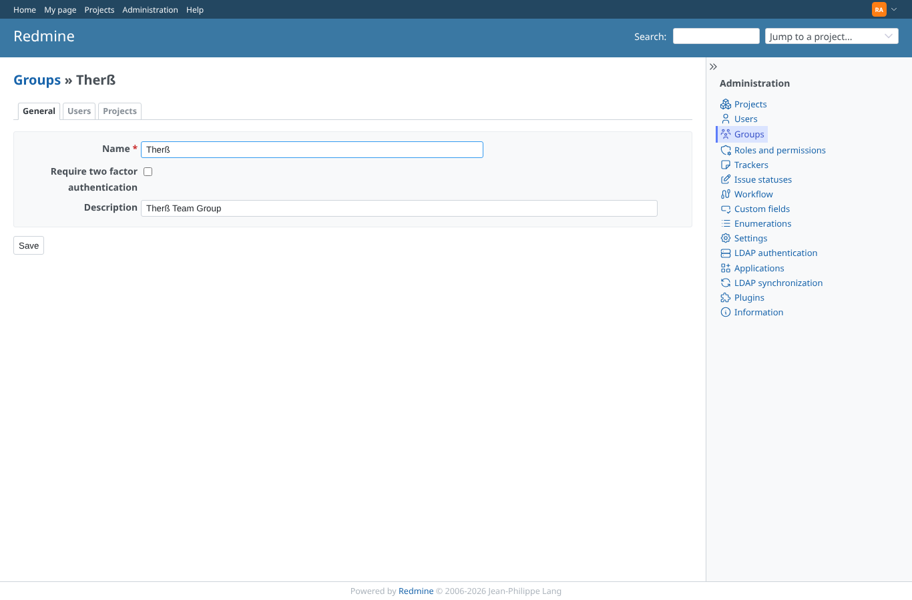
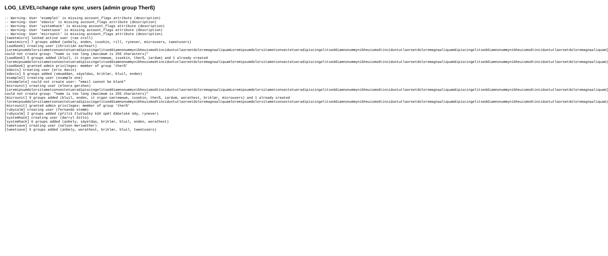
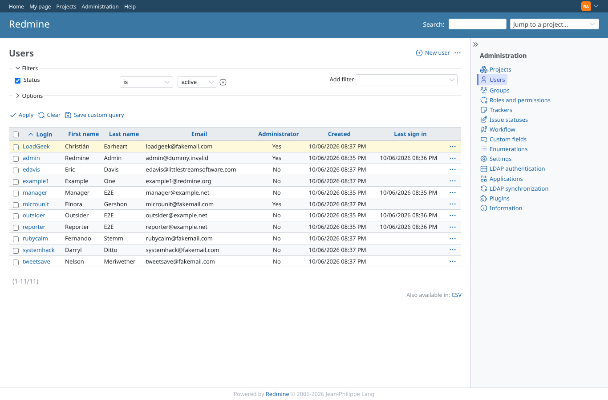
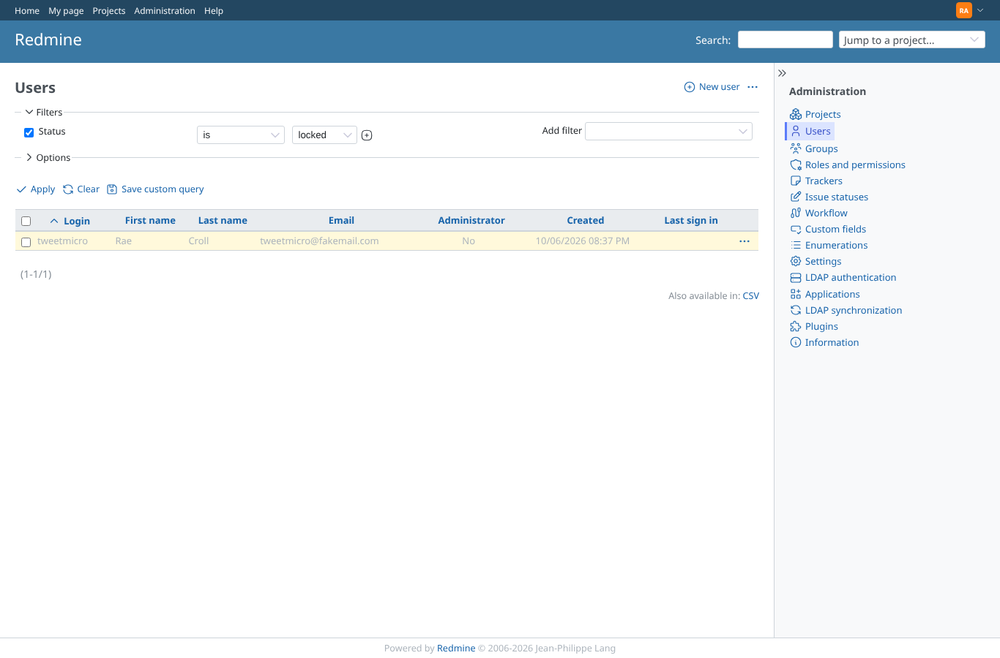
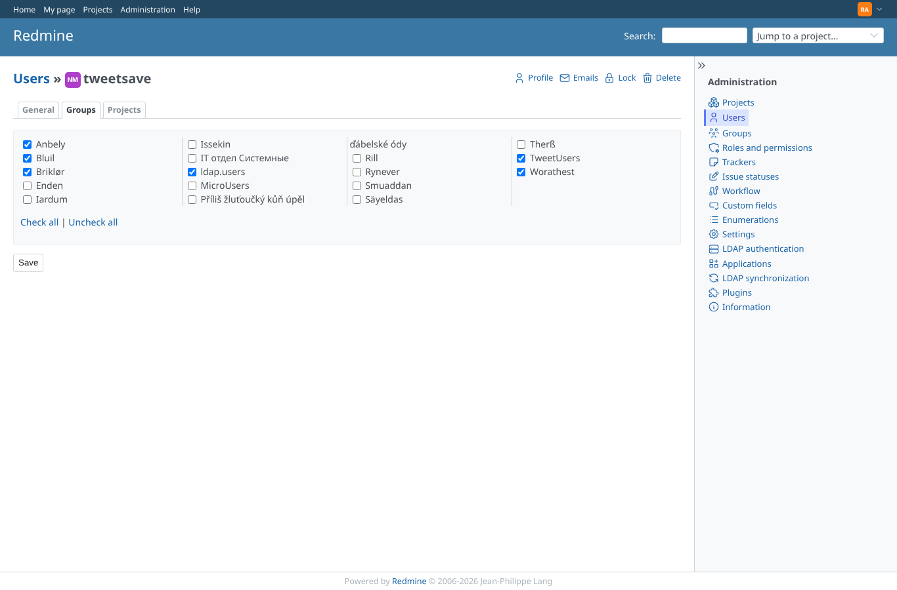
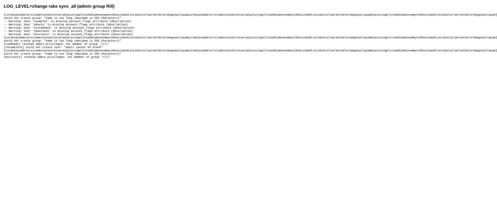
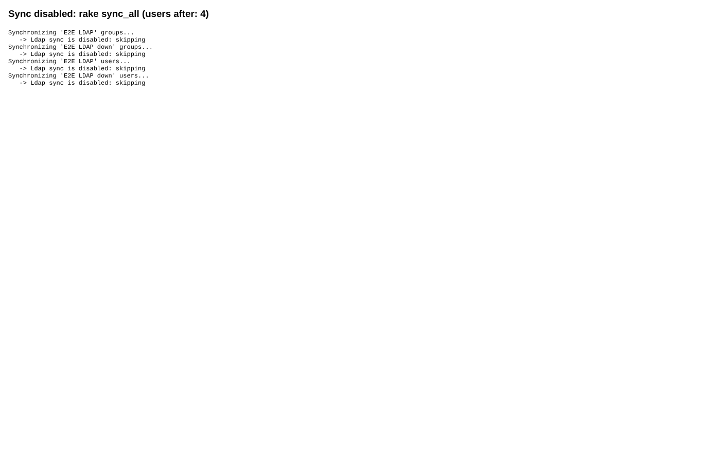

# rake_sync

Run 2026-10-07T16:54:17.307Z against http://127.0.0.1:3000.

| screenshot | user | URL | shows |
|---|---|---|---|
|  | admin | `/my/page` | DRY_RUN=1 rake sync_all: lists the groups and users it would create; users, groups, memberships and custom values unchanged |
|  | admin | `/groups` | After rake sync_groups: the LDAP groups (static and dynamic, Unicode names) exist in Redmine |
|  | admin | `/groups/72/edit` | Group Therß: custom field Description synced from LDAP ("Therß Team Group") |
|  | admin | `/groups/72/edit` | rake sync_users with LOG_LEVEL=change: one line per change (users created, groups added, admin granted, locked) |
|  | admin | `/users` | After rake sync_users: LDAP users created and active; LoadGeek and microunit administrators (members of Therß) |
|  | admin | `/users?set_filter=1&f[]=status&op[status]==&v[status][]=3` | Locked users: tweetmicro, active in Redmine before, locked by sync_users because it is disabled on LDAP |
|  | admin | `/users/86/edit?tab=groups` | User tweetsave: member of the dynamic group TweetUsers (groupOfURLs) after the rake run |
|  | admin | `/users/86/edit?tab=groups` | rake sync_all with administrators group Rill: loadgeek loses the admin flag; the server that is down is skipped (sync not enabled) |
|  | admin | `/users/86/edit?tab=groups` | With the sync of E2E LDAP disabled, rake sync_all skips it and creates nothing |
